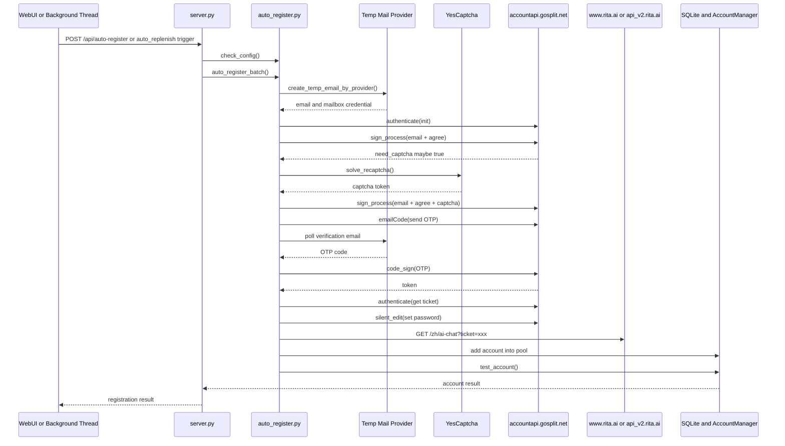

# Rita2API 注册整体流程说明

## 1. 文档目的

本文档用于说明本项目中 Rita 账号注册相关的完整链路、参与模块、关键配置、重试策略、数据落库方式以及与账号池/健康检查之间的关系。

适用范围：

- WebUI 手动注册
- 后台自动补号
- 注册完成后的账号入库与验活
- 邮箱验证码查询、Token 刷新、Ticket 获取等注册相关衍生链路

---

## 2. 一句话总览

本项目的注册主链路是：

**前端或后台触发注册 → 创建临时邮箱 → 调用 Rita/Gosplit 认证接口 → YesCaptcha 过验证码 → 轮询邮箱拿 OTP → 提交 OTP 完成注册 → 获取 token/ticket → 激活 Rita chat 侧 → 写入本地账号池 → 立即验活。**

---

## 3. 参与模块

### 3.1 主要文件

- `server.py`
  - Flask 主服务
  - 暴露手动注册 API、配置 API、邮箱状态 API
  - 启动时拉起健康检查和自动补号线程
- `auto_register.py`
  - 注册主实现
  - 负责邮箱创建、验证码获取、YesCaptcha 调用、Rita/Gosplit 注册、账号激活、Token 刷新
- `accounts.py`
  - 账号池管理
  - 负责新增账号、轮换账号、验活、健康检查、失败计数、自动禁用
- `database.py`
  - SQLite 数据层
  - 存储账号、配置、请求统计
- `templates/index.html`
  - WebUI 单页前端
  - 负责展示注册状态、触发手动注册、查看邮箱服务状态
- `register/register.py`
  - 独立批量注册工具
  - 和主服务内的注册逻辑同源，可作为参考实现或离线批量跑号工具

---

## 4. 三个入口

### 4.1 WebUI 手动注册

前端“账号注册”Tab 点击“🚀 手动注册”按钮后：

1. 读取注册数量
2. 调用 `POST /api/auto-register`
3. 后端检查配置是否齐全
4. 执行批量注册
5. 把结果返回前端并展示在注册日志区域

对应链路：

- 前端触发：`templates/index.html`
- 后端接口：`server.py -> /api/auto-register`
- 注册编排：`auto_register.auto_register_batch()`

### 4.2 后台自动补号

服务启动后会自动开启后台线程：

1. 启动 Token 健康检查线程
2. 启动自动补号线程
3. 自动补号线程定时检查“活跃账号数”
4. 若活跃账号低于阈值，则自动注册补充新账号

对应入口：`server.py` 启动段。

### 4.3 独立批量注册脚本

`register/register.py` 可不依赖 Flask 主服务直接执行批量注册。其流程与主服务中的注册主链高度一致，但更偏“独立离线脚本”。

---

## 5. 总体时序图

---

## 6. 注册前的配置检查

### 6.1 配置来源优先级

注册相关配置优先从 SQLite 的 `config` 表读取；如果数据库没有，再回退环境变量。

也就是说，WebUI 配置页修改后，注册逻辑无需重启即可使用新配置。

### 6.2 手动注册前检查项

`/api/auto-register` 在真正执行前会先调用 `auto_register.check_config()`，至少检查：

- `YESCAPTCHA_KEY` 是否存在
- 默认邮箱渠道是否配置完整
- 当前默认邮箱渠道是哪个
- `REGISTER_PROXY` 是否配置
- `MAIL_USE_PROXY` 是否开启
- 自动补号阈值与批量数量

若缺失配置，会直接返回错误，不进入注册主链。

### 6.3 关键配置项

#### 注册主链

- `AUTO_REGISTER_ENABLED`
- `AUTO_REGISTER_MIN_ACTIVE`
- `AUTO_REGISTER_BATCH`
- `AUTO_REGISTER_PASSWORD`
- `REGISTER_PROXY`
- `MAIL_USE_PROXY`
- `DISABLE_SSL_VERIFY`

#### 打码

- `YESCAPTCHA_KEY`

#### 邮箱渠道

- `MAIL_PROVIDER_DEFAULT`
- `GPTMAIL_API_KEY`
- `GPTMAIL_API_BASE`
- `YYDSMAIL_API_KEY`
- `YYDSMAIL_API_BASE`
- `MOEMAIL_API_KEY`
- `MOEMAIL_API_BASE`

---

## 7. 单个账号注册主流程

主实现函数：`auto_register.register_rita_account()`。

### 7.1 创建 Rita 注册会话

注册时不会直接用裸 `requests` 开始，而是优先尝试：

- 用 `curl_cffi` 构造带浏览器 TLS 指纹的 Session
- 模拟 Chrome 120 的请求头
- 维护 `token` / `visitorid` 这类会话字段

这样做的目的是尽量贴近浏览器行为，降低风控失败概率。

### 7.2 Step 1：`authenticate` 初始化会话

请求：

- `POST /authorize/authenticate`

作用：

- 初始化 Rita/Gosplit 注册会话
- 为后续步骤建立会话上下文

### 7.3 Step 2：`sign_process` 提交邮箱和同意协议

请求：

- `POST /authorize/sign_process`

提交内容：

- `email`
- `agree=1`
- `redirect_uri`
- `language=zh`

结果：

- 可能返回 `need_captcha=1`
- 同时响应里可能下发 `token` / `visitorid`

### 7.4 Step 3：如需要则走 YesCaptcha

如果上一步告诉服务端需要验证码，则会：

1. 调用 YesCaptcha
2. 按不同 task type 尝试求解
3. 最多重试 4 次
4. 拿到 `g-recaptcha-response` 后重新提交 `sign_process`

注意：

- 该项目对 captcha 失败有显式重试逻辑
- 重试之间会加随机等待，尽量模拟人工操作节奏

### 7.5 Step 4：触发发送邮箱验证码

请求：

- `POST /authorize/emailCode`

特点：

- 首次发送时，若前一步解出 captcha，会把 captcha token 一并提交
- 即使接口返回非 success，代码里也认为“验证码有可能已经发出”，因此不会立刻失败，而是继续进入邮箱轮询阶段

### 7.6 Step 5：轮询邮箱获取 OTP

项目支持 3 种邮箱渠道：

- GPTMail
- YYDSMail
- MoeMail

主逻辑会根据当前选择的邮件服务走不同查询函数：

- GPTMail：轮询 `/api/emails`，再按需请求邮件详情
- YYDSMail：先创建 mailbox，再用返回的 mailbox token 拉取消息详情
- MoeMail：用 mailbox credential 拉取消息和详情

OTP 获取策略：

- 单轮等待超时：90 秒
- 轮询间隔：3 秒
- 最多重发次数：2 次
- 如果第一次超时，则再次调用 `emailCode` 重发，然后继续轮询

### 7.7 Step 6：提交 OTP 完成注册

请求：

- `POST /authorize/code_sign`

提交内容：

- `email`
- `code`
- `redirect_uri`
- `language`
- `agreeTC=1`

特点：

- 如果 OTP 校验失败，代码会再触发一次重发，并尝试用新验证码重新提交一次
- 注册成功后，会从响应、headers、cookies 等多个位置兜底提取 `token`

### 7.8 Step 7：再次 `authenticate` 获取 ticket

注册成功拿到 token 后，还会再调一次：

- `POST /authorize/authenticate`

目的：

- 获取 `ticket`

### 7.9 Step 8：`silent_edit` 设置默认密码

请求：

- `POST /user/silent_edit`

用途：

- 给新注册账号设置项目配置中的默认密码

说明：

- 这里是“尽力而为”逻辑
- 即便设置密码失败，也不会回滚整个注册结果

### 7.10 Step 9：激活 Rita Chat 侧

注册完成后，项目还会访问：

- `https://www.rita.ai/zh/ai-chat?ticket=xxx`

作用：

- 把 auth 系统里的注册结果激活到 Rita chat 侧
- 避免“认证系统里已经有号，但 chat API 侧还未完全激活”的问题

这是本项目注册链路里一个很关键的补步骤。

---

## 8. 临时邮箱细节

### 8.1 GPTMail

特点：

- 由项目发请求生成邮箱地址
- 查询验证码时会先扫邮件标题，再按需拉取正文/HTML
- `mail_api_key` 存储形式相对简单，基本就是 API Key

### 8.2 YYDSMail

特点：

- 创建邮箱时要先拉取可用域名
- 真正查信时依赖 mailbox session token，不是只靠全局 API Key
- 因此项目会把这个 mailbox 级凭据序列化后保存下来，供后续刷新或查码复用

### 8.3 MoeMail

特点：

- 创建邮箱后返回 mailbox credential
- 后续查信通过 mailbox credential 拉取消息列表和详情
- `mail_api_key` 在数据库里会保存为一段 JSON，而不是单纯字符串

### 8.4 邮件渠道统一抽象

虽然 3 个邮箱服务 API 长得不一样，但项目做了统一抽象：

- 创建邮箱：`create_temp_email_by_provider()`
- 轮询验证码：`wait_for_code_by_provider()`

因此上层注册逻辑并不需要关心具体邮箱服务差异。

---

## 9. 会话状态与反爬细节

### 9.1 会话头自动更新

在 Rita/Gosplit 主链里，项目会在每次响应后尝试从响应数据中提取：

- `token`
- `visitorid`

然后把它们自动塞回下一次请求头。

这一步很重要，因为 Rita/Gosplit 的注册流程明显依赖跨步骤会话状态。

### 9.2 浏览器指纹

项目会伪装：

- Chrome 120
- Windows 平台
- 常见 Accept-Language
- 浏览器风格的 `sec-ch-ua` 相关头

目的是降低注册链路被识别为脚本流量的概率。

### 9.3 代理逻辑

项目把代理分成两层：

1. **注册主链代理**
   - 由 `REGISTER_PROXY` 控制
   - Rita/Gosplit 请求默认走它
   - YesCaptcha 请求也默认走它

2. **邮件链路是否复用注册代理**
   - 由 `MAIL_USE_PROXY` 控制
   - 关闭时，邮箱服务请求直连
   - 开启时，邮箱服务请求也复用 `REGISTER_PROXY`

---

## 10. 注册完成后的落库与验活

单个账号注册成功后，不会只把 token 返回给前端，而是继续执行后处理。

### 10.1 落库

项目会把以下信息存入 SQLite `accounts` 表：

- `token`
- `visitorid`（若有）
- `email`
- `password`
- `mail_provider`
- `mail_api_key`
- `enabled=1`
- `quota_remain=100`
- 统计字段与时间戳

### 10.2 命名规则

自动注册的新账号名称形如：

- `auto-<邮箱前缀>`

### 10.3 立即验活

入库后，项目会立刻调用 `AccountManager.test_account()` 测试新 token 是否可用。

测试方式：

- 调 Rita 上游 `/aichat/categoryModels`
- 若能正常返回模型列表，则认为 token 有效

作用：

- 尽早过滤“注册成功但实际不可用”的账号
- 让新号尽快纳入正常轮换池

---

## 11. 自动补号机制

自动补号线程在主服务启动时拉起。

### 11.1 启动前提

自动补号不会无条件启用，至少要求：

- `AUTO_REGISTER_ENABLED=1`
- `YESCAPTCHA_KEY` 已配置
- 默认邮箱渠道已配置完整

否则线程直接退出，不进入循环。

### 11.2 触发条件

后台线程每隔固定时间检查：

- 当前活跃账号数 `active`
- 最低活跃阈值 `AUTO_REGISTER_MIN_ACTIVE`
- 每次补号上限 `AUTO_REGISTER_BATCH`

触发逻辑：

- 当 `active < AUTO_REGISTER_MIN_ACTIVE` 时触发补号
- 补号数量 = `min(需要补的数量, AUTO_REGISTER_BATCH)`

### 11.3 当前真实行为说明

当前代码里，**真正接入补号判断的是“活跃账号数”**。

虽然数据库默认配置和前端文案里存在：

- `AUTO_REGISTER_MIN_QUOTA`

但在当前版本代码里，自动补号线程并没有实际使用它作为触发条件。

也就是说，当前自动补号是：

- **按账号数量补，不是按总剩余点数补。**

这个是理解本项目注册行为时很容易看漏的一点。

---

## 12. 账号池、轮换与健康检查的关系

注册不是孤立功能，它最后是要服务账号池的。

### 12.1 账号池挑号规则

正常请求会从 `enabled=1` 且 `quota_remain>0` 的账号里轮换挑选。

如果某个账号失败次数达到阈值，就暂时不参与优先挑选。

### 12.2 健康检查线程

主服务还会启动后台健康检查线程：

1. 定时遍历已启用账号
2. 调用 `test_account()` 测试可用性
3. 若发现 401，则自动：
   - 标记 `token_valid=0`
   - `enabled=0`
   - 写入 `disabled_reason=token_expired_401`

这意味着：

- 新注册账号会先入池
- 后续若 token 过期，会被健康检查自动禁用
- 自动补号线程则会在活跃账号不够时继续补新号

因此“注册”和“账号池运营”其实是闭环关系。

---

## 13. 注册相关衍生链路

### 13.1 手动查询验证码

接口：`POST /api/mail/check-code`

用途：

- 可以直接指定 `email + mail_provider + mail_api_key`
- 也可以只给 `account_id`，由系统自动读取账号表里的邮箱配置

适合：

- 排查为什么迟迟没收到 OTP
- 验证某个邮箱渠道是否正常工作

### 13.2 查看邮箱服务状态

接口：`GET /api/mail/status`

返回：

- 当前默认邮箱渠道
- GPTMail/YYDSMail/MoeMail 是否已配置
- 各自 API Base

### 13.3 刷新已存在账号 Token

项目不只是会注册新号，也支持对已有账号重新登录拿新 token。

对应逻辑：

- `auto_register.refresh_account_token()`

大体链路与注册类似：

- 重新建会话
- 如需 captcha 继续过 captcha
- 发邮箱码
- 取 OTP
- 提交 OTP
- 获取新 token/ticket

### 13.4 仅根据旧 token 获取 ticket

如果 token 还活着，只是需要重新拿一个 ticket，则可以走：

- `auto_register.relogin_for_ticket()`

这个链路比重新完整登录更轻量。

---

## 14. WebUI 展示的注册信息

“账号注册”Tab 不只是按钮，它还会展示几类运行态信息：

- 自动注册是否启用
- Captcha 是否配置
- 默认邮箱渠道是否可用
- 代理是否启用，以及邮件链路是否复用代理
- 当前账号池活跃数 / 总数 / 总点数

因此用户在点“手动注册”前，通常可以先从前端直接看出缺了哪类配置。

---

## 15. 数据存储结构

### 15.1 数据库文件

- `data/rita.db`

### 15.2 主要表

#### `accounts`

用于存账号池，关键字段包括：

- `id`
- `name`
- `token`
- `visitorid`
- `enabled`
- `email`
- `password`
- `mail_provider`
- `mail_api_key`
- `quota_remain`
- `failures`
- `token_valid`
- `disabled_reason`

#### `config`

用于存所有运行时配置。WebUI 修改的注册相关配置最终都落这里。

#### `usage_log`

用于存模型调用统计，与注册本身不是一条链，但会影响前端状态展示。

---

## 16. 重试与容错策略

项目在注册主链里做了不少“尽量注册成功”的设计：

### 16.1 Captcha 重试

- 最多 4 次
- 多 task type 兜底
- 失败后有等待间隔

### 16.2 OTP 重发

- 邮箱等待超时会自动重发
- 最多重发 2 次

### 16.3 OTP 校验失败兜底

- 如果 `code_sign` 失败
- 会尝试再发一次验证码
- 再用新验证码提交一次

### 16.4 设置密码非阻断

- `silent_edit` 失败不会直接让整次注册判定失败

### 16.5 激活 chat 侧非阻断

- `ticket` 激活失败只记 warning
- 不会回滚已获取到的 token

这说明项目对注册链路的设计倾向是：

**主链先保 token 成功，附加步骤尽量补全，但不轻易整单失败。**

---

## 17. 当前实现的边界与注意点

### 17.1 主服务内批量注册实际上是串行的

`auto_register.auto_register_batch()` 当前是一个 for 循环逐个注册，不是并发注册。

因此：

- 手动一次注册多个账号时，会逐个跑
- 中间还会插入 5~15 秒随机等待

这更稳，但速度不会很快。

### 17.2 自动补号按活跃账号数触发，不按总点数触发

虽然配置里有 `AUTO_REGISTER_MIN_QUOTA`，但当前代码尚未真正接入补号判定。

### 17.3 邮箱凭据存储格式因 provider 而异

- GPTMail：更接近简单字符串
- YYDSMail / MoeMail：更接近 JSON 结构化凭据

因此后续如果做批量导出、迁移、外部同步，不能简单假设 `mail_api_key` 永远是纯字符串。

### 17.4 注册接口依赖外部服务

整个注册链依赖多个外部系统：

- Rita / Gosplit
- YesCaptcha
- 临时邮箱服务

所以注册失败不一定是代码问题，也可能是：

- 外部服务异常
- 代理异常
- 域名 / SSL / 网络问题
- 邮件提供商延迟
- Captcha 风控变化

---

## 18. 与独立脚本 `register/register.py` 的关系

主服务里的 `auto_register.py` 和 `register/register.py` 都在实现 Rita 注册，但定位不同：

### `auto_register.py`

- 给 Flask 主服务用
- 与 SQLite 账号池集成
- 注册完会自动落库、验活、进入轮换池
- 支持后台自动补号

### `register/register.py`

- 更像离线批量注册工具
- 自带并发批量注册、结果输出、上传功能
- 可独立运行，不依赖 WebUI 主服务

所以如果你在读代码时看到两份“注册流程”，不要误认为重复废代码；它们是两个不同运行形态下的实现。

---

## 19. 最终闭环总结

本项目的注册不是单纯“拿到一个 token”就结束，而是一个完整闭环：

1. 检查配置
2. 选邮箱渠道并创建临时邮箱
3. 与 Rita/Gosplit 建立认证会话
4. 如需则完成 reCAPTCHA
5. 发验证码邮件
6. 轮询邮箱拿 OTP
7. 提交 OTP 完成注册
8. 获取 token 和 ticket
9. 设置默认密码
10. 激活 Rita chat 侧
11. 把账号写入本地账号池
12. 立即验活
13. 后续由健康检查和自动补号机制持续维护账号池质量

换句话说，这套注册逻辑本质上是本项目“账号供应链”的上游入口。

---

## 20. 相关文档

- [注册后聊天请求轮换流程](./注册后聊天请求轮换流程.md)
- [健康检查、自动补号、刷新 Token 联动流程](./健康检查自动补号刷新Token联动流程.md)
